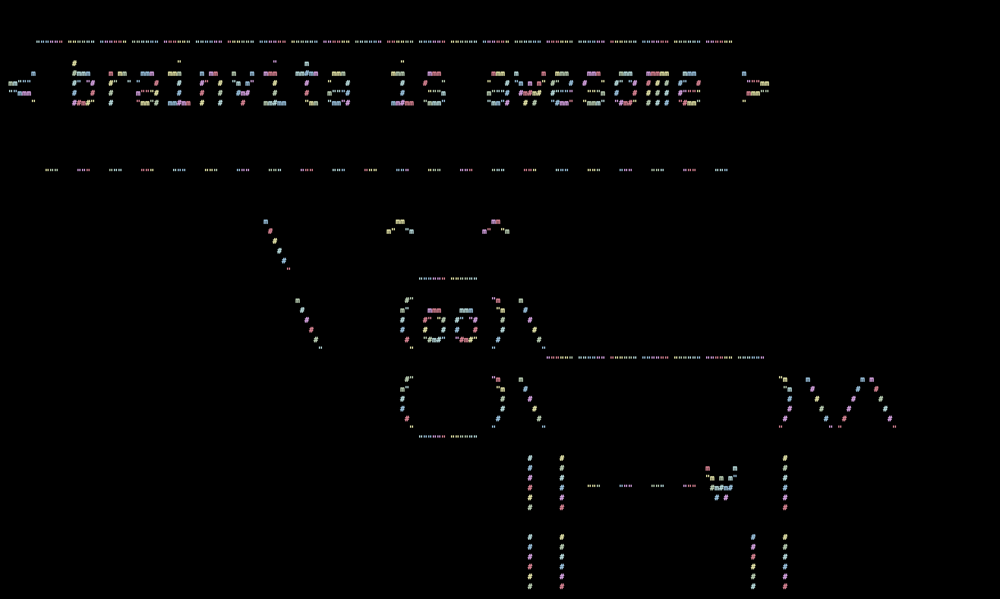

# Brainvita

[PyGame](www.pygame.org) implementation of a classic single player puzzle game also known as [Marble Solitare](https://en.wikipedia.org/wiki/Peg_solitaire).
Objective of the game is get the lowest number of remaining marbles when no other legal move can be made.

Implements the [Best First Search algorithm](https://en.wikipedia.org/wiki/Best-first_search) to solve the game using AI 
Search Methods.

## Implementations Details

## Screenshots

## Installation

## Demo
